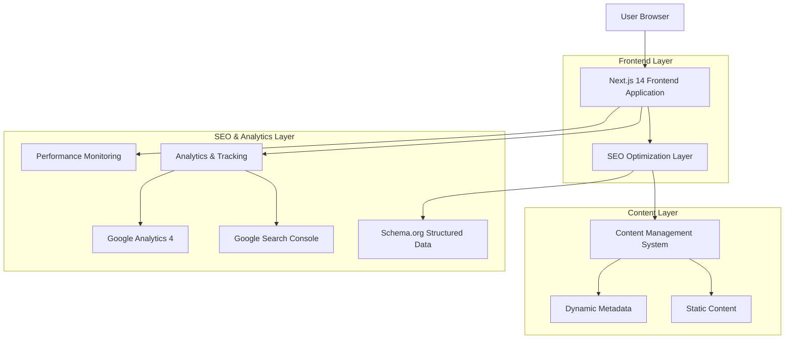

# Technical Architecture Document - SEO-Optimized Lumbung Group Website

## 1. Architecture Design



## 2. Technology Description

- **Frontend**: Next.js 14 (App Router) + React 18 + TypeScript + Tailwind CSS
- **SEO Framework**: Next.js built-in SEO features + Custom metadata management
- **Analytics**: Google Analytics 4 + Google Search Console + Core Web Vitals monitoring
- **Performance**: Next.js Image Optimization + Static Generation + Edge Runtime
- **Deployment**: Vercel (recommended) or Netlify for optimal performance
- **Content**: Static content with dynamic metadata generation

## 3. Route Definitions

| Route | Purpose | SEO Priority |
|-------|---------|-------------|
| / | Homepage with hero, about, subsidiaries, products sections | High (Priority 1.0) |
| /about | Detailed company information and history | High (Priority 0.9) |
| /services | Comprehensive services overview | High (Priority 0.9) |
| /subsidiaries | Individual subsidiary pages | Medium (Priority 0.8) |
| /products | Product catalog and solutions | Medium (Priority 0.8) |
| /contact | Contact information and inquiry forms | Medium (Priority 0.7) |
| /blog | SEO content hub for industry insights | High (Priority 0.9) |
| /sitemap.xml | XML sitemap for search engines | Technical |
| /robots.txt | Search engine crawling instructions | Technical |

## 4. SEO Architecture Components

### 4.1 Metadata Management System

```typescript
// types/seo.ts
export interface SEOMetadata {
  title: string
  description: string
  keywords: string[]
  openGraph: {
    title: string
    description: string
    images: OpenGraphImage[]
    type: 'website' | 'article'
  }
  twitter: {
    card: 'summary' | 'summary_large_image'
    title: string
    description: string
    images: string[]
  }
  structuredData?: Record<string, any>
  canonical?: string
  alternates?: {
    languages: Record<string, string>
  }
}

// lib/seo-config.ts
export const defaultSEO: SEOMetadata = {
  title: 'Lumbung Group - Leading Indonesian Conglomerate',
  description: 'Indonesia\'s premier conglomerate driving sustainable progress across logistics, energy, technology, and travel industries.',
  keywords: [
    'Indonesian conglomerate',
    'logistics services Indonesia',
    'energy trading Indonesia',
    'technology solutions Indonesia',
    'travel services Indonesia'
  ],
  openGraph: {
    title: 'Lumbung Group - Leading Indonesian Conglomerate',
    description: 'Indonesia\'s premier conglomerate driving sustainable progress across logistics, energy, technology, and travel industries.',
    images: [{
      url: '/images/og-image.jpg',
      width: 1200,
      height: 630,
      alt: 'Lumbung Group Indonesian Conglomerate'
    }],
    type: 'website'
  },
  twitter: {
    card: 'summary_large_image',
    title: 'Lumbung Group - Leading Indonesian Conglomerate',
    description: 'Indonesia\'s premier conglomerate driving sustainable progress.',
    images: ['/images/twitter-image.jpg']
  }
}
```

### 4.2 Structured Data Implementation

```typescript
// lib/structured-data.ts
export const organizationSchema = {
  "@context": "https://schema.org",
  "@type": "Organization",
  "name": "Lumbung Group",
  "alternateName": "PT. Lumbung Group Indonesia",
  "url": "https://lumbunggroup.co.id",
  "logo": "https://lumbunggroup.co.id/images/logos/logo-lumbunggroup.png",
  "description": "Leading Indonesian conglomerate specializing in logistics, energy, technology, and travel services",
  "foundingDate": "1999",
  "address": {
    "@type": "PostalAddress",
    "streetAddress": "Ruko Pariwarna Niaga No. 7",
    "addressLocality": "Kota Baru Parahyangan",
    "addressRegion": "Kab. Bandung Barat",
    "addressCountry": "Indonesia"
  },
  "contactPoint": {
    "@type": "ContactPoint",
    "telephone": "+62-822-888-236",
    "contactType": "customer service",
    "email": "support@lumbunggroup.co.id"
  },
  "sameAs": [
    "https://www.linkedin.com/company/lumbung-group",
    "https://www.instagram.com/lumbunggroup",
    "https://twitter.com/lumbunggroup"
  ],
  "hasOfferCatalog": {
    "@type": "OfferCatalog",
    "name": "Lumbung Group Services",
    "itemListElement": [
      {
        "@type": "Offer",
        "itemOffered": {
          "@type": "Service",
          "name": "Logistics & Transportation Services",
          "description": "Comprehensive logistics solutions across Indonesia"
        }
      },
      {
        "@type": "Offer",
        "itemOffered": {
          "@type": "Service",
          "name": "Energy Trading Services",
          "description": "Licensed energy trading and coal distribution"
        }
      }
    ]
  }
}

export const websiteSchema = {
  "@context": "https://schema.org",
  "@type": "WebSite",
  "name": "Lumbung Group",
  "url": "https://lumbunggroup.co.id",
  "description": "Official website of Lumbung Group - Leading Indonesian Conglomerate",
  "publisher": {
    "@type": "Organization",
    "name": "Lumbung Group"
  },
  "potentialAction": {
    "@type": "SearchAction",
    "target": "https://lumbunggroup.co.id/search?q={search_term_string}",
    "query-input": "required name=search_term_string"
  }
}
```

### 4.3 Performance Optimization Architecture

```typescript
// next.config.js
const nextConfig = {
  // Image optimization
  images: {
    domains: ['images.unsplash.com', 'lumbunggroup.co.id'],
    formats: ['image/webp', 'image/avif'],
    deviceSizes: [640, 750, 828, 1080, 1200, 1920, 2048, 3840],
    imageSizes: [16, 32, 48, 64, 96, 128, 256, 384],
  },
  
  // Compression
  compress: true,
  
  // Static optimization
  output: 'export', // For static hosting
  trailingSlash: true,
  
  // SEO optimizations
  generateEtags: false,
  poweredByHeader: false,
  
  // Headers for SEO
  async headers() {
    return [
      {
        source: '/(.*)',
        headers: [
          {
            key: 'X-Content-Type-Options',
            value: 'nosniff',
          },
          {
            key: 'X-Frame-Options',
            value: 'DENY',
          },
          {
            key: 'X-XSS-Protection',
            value: '1; mode=block',
          },
        ],
      },
    ]
  },
  
  // Redirects for SEO
  async redirects() {
    return [
      {
        source: '/home',
        destination: '/',
        permanent: true,
      },
    ]
  },
}
```

## 5. SEO Monitoring & Analytics Architecture

### 5.1 Analytics Integration

```typescript
// lib/analytics.ts
export class SEOAnalytics {
  private static instance: SEOAnalytics
  
  static getInstance(): SEOAnalytics {
    if (!SEOAnalytics.instance) {
      SEOAnalytics.instance = new SEOAnalytics()
    }
    return SEOAnalytics.instance
  }
  
  // Google Analytics 4
  trackPageView(url: string) {
    if (typeof window !== 'undefined' && window.gtag) {
      window.gtag('config', process.env.NEXT_PUBLIC_GA_ID, {
        page_path: url,
      })
    }
  }
  
  // Core Web Vitals tracking
  trackWebVitals(metric: any) {
    if (typeof window !== 'undefined' && window.gtag) {
      window.gtag('event', metric.name, {
        event_category: 'Web Vitals',
        event_label: metric.id,
        value: Math.round(metric.name === 'CLS' ? metric.value * 1000 : metric.value),
        non_interaction: true,
      })
    }
  }
  
  // SEO-specific events
  trackSEOEvent(action: string, category: string, label?: string) {
    if (typeof window !== 'undefined' && window.gtag) {
      window.gtag('event', action, {
        event_category: category,
        event_label: label,
      })
    }
  }
}
```

### 5.2 Search Console Integration

```typescript
// lib/search-console.ts
export interface SearchConsoleData {
  clicks: number
  impressions: number
  ctr: number
  position: number
  query: string
  page: string
}

export class SearchConsoleAPI {
  private apiKey: string
  private siteUrl: string
  
  constructor(apiKey: string, siteUrl: string) {
    this.apiKey = apiKey
    this.siteUrl = siteUrl
  }
  
  async getSearchAnalytics(startDate: string, endDate: string): Promise<SearchConsoleData[]> {
    const response = await fetch(
      `https://www.googleapis.com/webmasters/v3/sites/${encodeURIComponent(this.siteUrl)}/searchAnalytics/query`,
      {
        method: 'POST',
        headers: {
          'Authorization': `Bearer ${this.apiKey}`,
          'Content-Type': 'application/json',
        },
        body: JSON.stringify({
          startDate,
          endDate,
          dimensions: ['query', 'page'],
          rowLimit: 1000,
        }),
      }
    )
    
    const data = await response.json()
    return data.rows || []
  }
}
```

## 6. Content Management Architecture

### 6.1 Dynamic Content System

```typescript
// lib/content-manager.ts
export interface ContentItem {
  id: string
  title: string
  description: string
  content: string
  seoMetadata: SEOMetadata
  publishedAt: Date
  updatedAt: Date
  category: string
  tags: string[]
  slug: string
}

export class ContentManager {
  private static content: Map<string, ContentItem> = new Map()
  
  static addContent(item: ContentItem): void {
    this.content.set(item.id, item)
  }
  
  static getContent(id: string): ContentItem | undefined {
    return this.content.get(id)
  }
  
  static getContentBySlug(slug: string): ContentItem | undefined {
    return Array.from(this.content.values()).find(item => item.slug === slug)
  }
  
  static getAllContent(): ContentItem[] {
    return Array.from(this.content.values())
  }
  
  static getContentByCategory(category: string): ContentItem[] {
    return Array.from(this.content.values()).filter(item => item.category === category)
  }
}
```

## 7. SEO Testing & Validation Architecture

### 7.1 Automated SEO Testing

```typescript
// tests/seo.test.ts
import { render } from '@testing-library/react'
import { expect, test, describe } from 'vitest'

describe('SEO Tests', () => {
  test('should have proper meta tags', () => {
    // Test metadata presence
    const metaDescription = document.querySelector('meta[name="description"]')
    expect(metaDescription).toBeTruthy()
    expect(metaDescription?.getAttribute('content')).toContain('Indonesian conglomerate')
  })
  
  test('should have structured data', () => {
    // Test JSON-LD structured data
    const structuredData = document.querySelector('script[type="application/ld+json"]')
    expect(structuredData).toBeTruthy()
    
    const data = JSON.parse(structuredData?.textContent || '{}')
    expect(data['@type']).toBe('Organization')
    expect(data.name).toBe('Lumbung Group')
  })
  
  test('should have proper heading hierarchy', () => {
    // Test H1-H6 hierarchy
    const h1Elements = document.querySelectorAll('h1')
    expect(h1Elements.length).toBe(1) // Only one H1 per page
  })
  
  test('should have alt text for images', () => {
    // Test image accessibility
    const images = document.querySelectorAll('img')
    images.forEach(img => {
      expect(img.getAttribute('alt')).toBeTruthy()
    })
  })
})
```

## 8. Deployment & Performance Architecture

### 8.1 Build Optimization

```typescript
// scripts/build-optimization.ts
export class BuildOptimizer {
  static async optimizeImages(): Promise<void> {
    // Image compression and WebP conversion
    console.log('Optimizing images for SEO performance...')
  }
  
  static async generateSitemap(): Promise<void> {
    // Dynamic sitemap generation
    console.log('Generating SEO sitemap...')
  }
  
  static async validateSEO(): Promise<void> {
    // SEO validation checks
    console.log('Validating SEO implementation...')
  }
  
  static async generateRobotsTxt(): Promise<void> {
    // Robots.txt generation
    console.log('Generating robots.txt...')
  }
}
```

### 8.2 Performance Monitoring

```typescript
// lib/performance-monitor.ts
export class PerformanceMonitor {
  static measureCoreWebVitals(): void {
    // Largest Contentful Paint (LCP)
    new PerformanceObserver((entryList) => {
      for (const entry of entryList.getEntries()) {
        console.log('LCP:', entry.startTime)
        SEOAnalytics.getInstance().trackWebVitals({
          name: 'LCP',
          value: entry.startTime,
          id: 'lcp-measurement'
        })
      }
    }).observe({ entryTypes: ['largest-contentful-paint'] })
    
    // First Input Delay (FID)
    new PerformanceObserver((entryList) => {
      for (const entry of entryList.getEntries()) {
        console.log('FID:', entry.processingStart - entry.startTime)
        SEOAnalytics.getInstance().trackWebVitals({
          name: 'FID',
          value: entry.processingStart - entry.startTime,
          id: 'fid-measurement'
        })
      }
    }).observe({ entryTypes: ['first-input'] })
    
    // Cumulative Layout Shift (CLS)
    let clsValue = 0
    new PerformanceObserver((entryList) => {
      for (const entry of entryList.getEntries()) {
        if (!entry.hadRecentInput) {
          clsValue += entry.value
        }
      }
      console.log('CLS:', clsValue)
      SEOAnalytics.getInstance().trackWebVitals({
        name: 'CLS',
        value: clsValue,
        id: 'cls-measurement'
      })
    }).observe({ entryTypes: ['layout-shift'] })
  }
}
```

## 9. Security & SEO Architecture

### 9.1 Security Headers for SEO

```typescript
// middleware.ts
import { NextResponse } from 'next/server'
import type { NextRequest } from 'next/server'

export function middleware(request: NextRequest) {
  const response = NextResponse.next()
  
  // Security headers that benefit SEO
  response.headers.set('X-Content-Type-Options', 'nosniff')
  response.headers.set('X-Frame-Options', 'DENY')
  response.headers.set('X-XSS-Protection', '1; mode=block')
  response.headers.set('Referrer-Policy', 'strict-origin-when-cross-origin')
  
  // Cache control for SEO assets
  if (request.nextUrl.pathname.startsWith('/images/')) {
    response.headers.set('Cache-Control', 'public, max-age=31536000, immutable')
  }
  
  return response
}

export const config = {
  matcher: '/((?!api|_next/static|_next/image|favicon.ico).*)',
}
```

This technical architecture provides a comprehensive foundation for implementing SEO-optimized features while maintaining high performance and scalability for the Lumbung Group website.